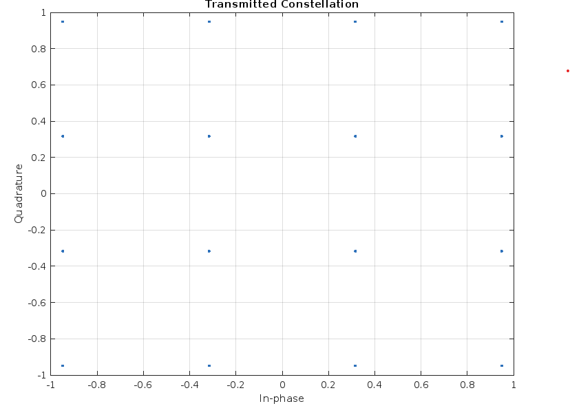
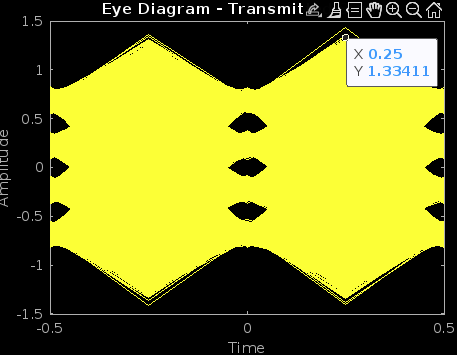

# QAM Communication System Simulation

This MATLAB project simulates a 16-QAM communication system including transmitter, channel with noise, receiver with LMS equalization, and error control coding (Hamming (7,4)).

---

## Features

- Bit generation and 16-QAM Gray mapping
- Pulse shaping with Root Raised Cosine filter
- Transmission over a multipath channel with AWGN noise
- LMS equalizer to mitigate channel effects
- BER calculation without ECC
- Implementation of Hamming (7,4) error control coding (to be completed)

---

## MATLAB Code Files

- `qam_comm_system.m`: Main simulation script including transmitter, channel, receiver, and equalization.
- (Add other code files here if any)

---

## Output Plots

### Transmitted Constellation  

  

### Transmitted Eye Diagram  

  

### Channel Frequency Response  

  

### Received Eye Diagram  

  

### LMS Error Convergence  

  

### Equalizer Frequency Response  

  

### Equalized Constellation  

  

---

## How to Run

1. Open MATLAB.
2. Run the `qam_comm_system.m` script.
3. The script generates plots and calculates BER.
4. Saved figures are in the `figures` folder.

---

## Author

Usama Bin Sohaib  
Student ID: 153015748  
Email: usamabin.sohaib@tuni.fi  
Tampere University, Finland

---

## License

This project is licensed under the MIT License - see the [LICENSE](LICENSE) file for details.
